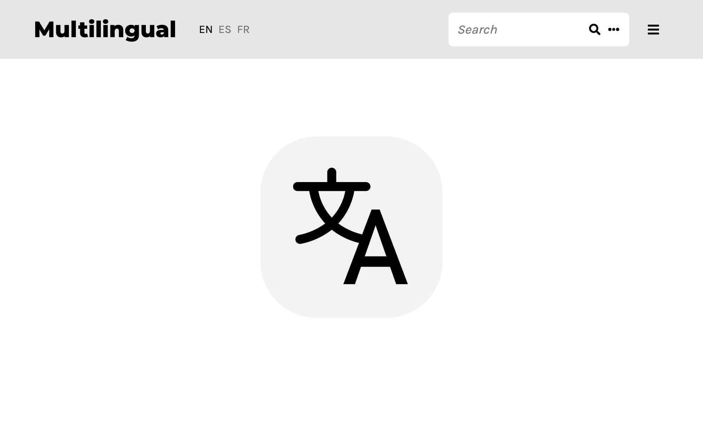

# Multilingual: Omeka S theme

This Omeka S theme allows for end-user locale switching and more thorough translation capabilities.

## Preview

## Installation

Use the zipped releases provided on GitHub for a standard install.

## Dependencies

The module [Internationalisation](https://github.com/Daniel-KM/Omeka-S-module-Internationalisation) should be installed and configured to enable full functionality. If you use non-standard resource template labels, you'll also need [Translations](https://github.com/Daniel-KM/Omeka-S-module-Translations).

## License

This theme is builds upon [The Daily](https://github.com/omeka-s-themes/thedaily), inheriting its [GPLv3 license](LICENSE).