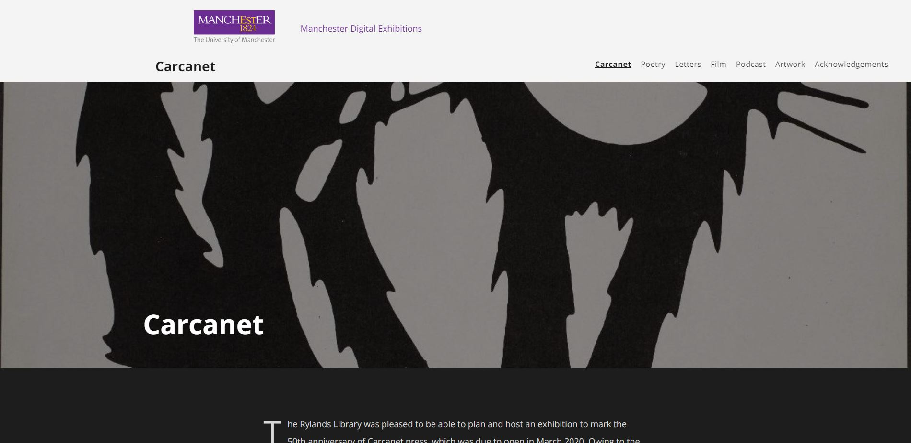

# Multilingual: Omeka S theme

*[Leer en Español](README.es.md)*

This Omeka S theme allows for end-user locale switching.

## Preview

## Installation

For the time being, this theme doesn't have official releases or versions. Changes are made on a rolling basis through git. To install, simply clone the repository. You should occasionally update it with `git pull`.

## Dependencies

The module [Internationalisation](https://github.com/Daniel-KM/Omeka-S-module-Internationalisation) should be installed and configured to enable full functionality. Omeka S version 3.1.0 or later is recommended.

## License

This theme is builds upon [The Daily](https://github.com/omeka-s-themes/thedaily), inheriting its [GPLv3 license](LICENSE).
